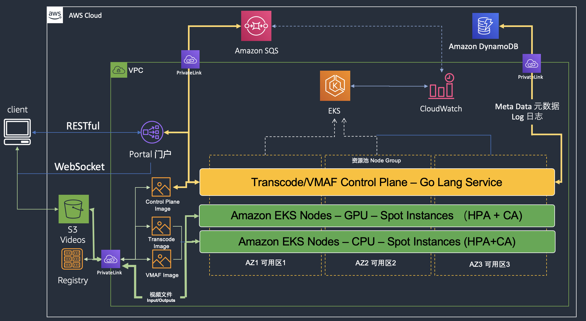

# AWS Elastic Recode

## Introduction ([中文版本](./README_zh.md))

Transcode jobs are the most resource intensive workload for media / gaming studio customers, customers can achieve performance, cost and elastic of large scale transcode jobs on AWS. 

> *This is A Media Solution that Maximizes Transcoding Flexibility and Scalability while Creating a Cost-effective Transcoding Option for AWS Customers*

The major components include:

1. **Web UI** : interactive user experience
2. **Transcode Docker Images**: encapsulate the transcode & VMAF scoring details into docker image, so customer can get started quickly and adopt it according to your own business requirements
3. **Large Scale Jobs Schedule & Execution**: We take advantage of Kubernates, the opensource container orchestration platform, and AWS to provide large scale cost performance EC2 spot instances. Most important, we design and implement a reference control plane service to help customer manage the large scale transcode jobs.

Here is the current version solution architecture:

Base on the above architecture, the customer experience will be:

* All videos include source videos and output videos will be saved to Amazon S3 automatically
* The solution simplify and standardize the transcode profiles
* Customer can review the estimated dry-run statistic report before actually execution
* Customer can track the jobs status and drill down the detail logs through the realtime websocket tunnel
* The backend compute instances support CPU and GPU platform
* AWS EKS will auto scaled according to the number of submitted jobs

## About the Workshop?

Created by AWS Solution Architect team China, this workshop aims to guide customer to experience transcode jobs using docker and how to manage & schedule large scale transcode jobs on AWS EKS.

In this workshop, you will learn:

* What are the inputs and outputs of a trancode job?
* What does VMAF scoring means and how it works?
* Submit and monitor jobs through our easy to use web UI
* Review and understand the estimated dry run results
* Run jobs using scripts to learn more details about the transcode progress
* Why we need a control plane for large scale jobs and how it works?
* Why spot instances matter to you, and how it works with AWS EKS?
* Run large scale jobs on AWS EKS and with our reference control plane service implementation

## Security

See [CONTRIBUTING](CONTRIBUTING.md#security-issue-notifications) for more information.

## License

This library is licensed under the MIT-0 License. See the LICENSE file.