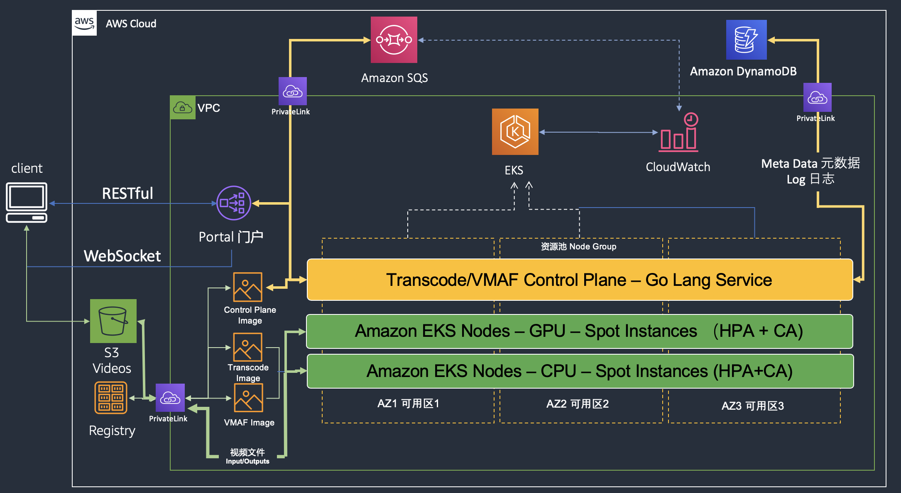

# AWS Elastic Recode

## 简介 ([English](README.md))

1. 本方案实现弹性伸缩的专业媒体处理能力，支持客户快速构建EKS+Spot的弹性扩展转码集群，灵活使用基于自定义转码Image或者使用本方案已经优化的转码Image，提供客户提交任务、任务监控、任务管理、资源监控的功能实现和基本可视化UI，将高负载的转码任务快速迁移或扩容到AWS上，从而以较低成本、高效完成专业媒体处理任务。

   本方案支持两种部署模式：

   1，Hybrid Mode: Broadcasters, OTT Providers, Digital Media Providers 是主要客户，其中大多数已经拥有本地的基础实施，此解决方案可用于卸载突发的工作负载。 随着新的编解码技术的发展（例如AV1或HEVC），他们还需要一种高性价比、高可扩展的解决方案以在云中灵活地承担新增的工作量。 客户可以从本地提交他们的工作，并利用他们自己的媒体处理Image并管理转码工作的调度； * Elastic Recode *负责Kubernetes基础架构，例如自动扩展，集群状态监视和实时反馈。

   2，Native Cloud Mode: e-commerce, Net Disk Provider, Online Education, 是另一类有需求客户，并非专业的媒体平台，但是希望构建媒体系统。 他们可以在AWS中构建整个媒体处理能力，并利用* Elastic Recode *来**支持基于文件的转码工作流程。 客户通过门户或命令行提交转码作业，向SQS发送任务（例如分辨率，比特率，编解码器，配置文件）和标签（实例关联性（例如实例类型）），一旦转码作业完成，结果媒体内容将被传送到目标存储。 对于异常中断的作业，可以重新拉起相应服务。

   本方案包括三个部分：

   1，编码平面：

   （1）计算资源池在不同转码任务执行中的Benchmark

   （2）基于CPU / GPU的基础转码镜像

   （3）支持质量优先/速度优先的转码Profile

   （4）支持VMAF、PSNR、SSIM的客观评价能力

   （5）支持高并发的批处理任务

   （6）开放Codec、Bitrate、Resolution、NodeGroup等基本转码接口

   2，IT平面

   （1）EKS Control Plane

   （2）EC2 Instance: 不同region的OD + Spot Instance

   （3）EKS HPA：Pod Scaling

   （4）EKS CA：Node Scaling

   （5）Container：Spec

   3，控制平面

   （1）转码任务提交，支持单调队列管理，转码集群选择 Affinity，转码参数，Dry-run以 预估成本/时长

   （2）转码任务状态监控，支持容器任务执行进度显示，Stdout

   （3）支持POD级任务控制，中断、重启等工作

当前解决方案架构:

## Security

See [CONTRIBUTING](CONTRIBUTING.md#security-issue-notifications) for more information.

## License

This library is licensed under the MIT-0 License. See the LICENSE file.